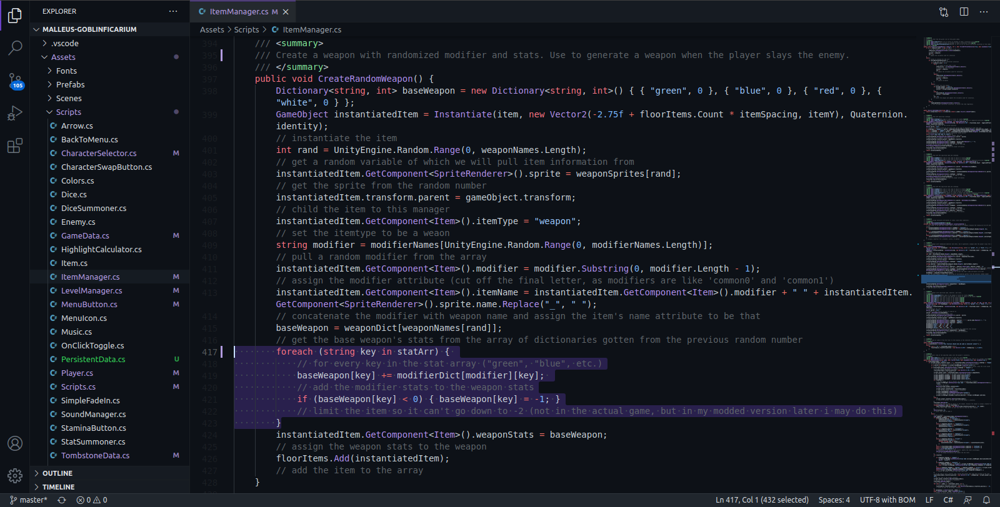

A theme based on the official Github Dark theme, but with purple accents!

After installing the extension, 
select Tools | Themes | Github Purple.

---

Credits:
- Jeff Chen ([4a454646](https://github.com/4a454646))
for his [Github Purple](https://marketplace.visualstudio.com/items?itemName=4a454646.github-purple)
VS Code theme

- the [Github Theme](https://marketplace.visualstudio.com/items?itemName=GitHub.github-vscode-theme)
developers